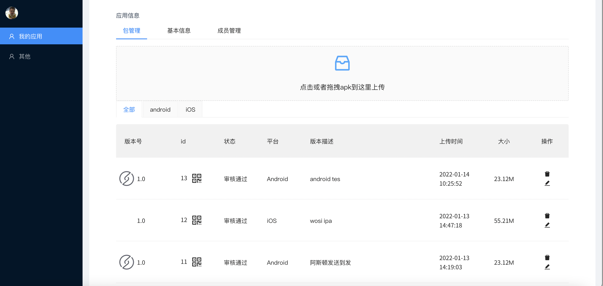
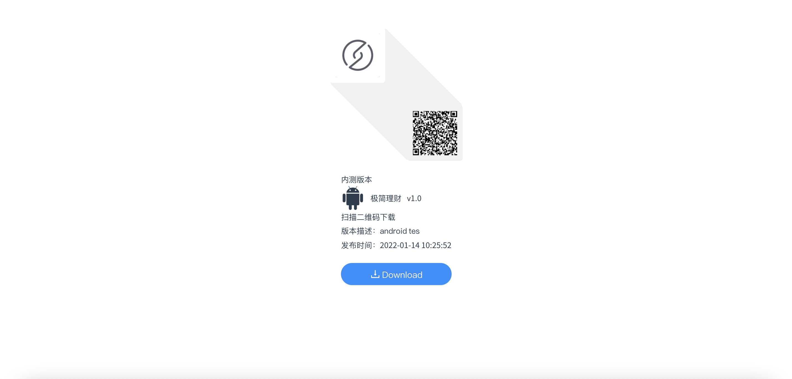

# myflight

## 组件初始化

1. vue create flight
2. ant-design安装：
   1. npm install ant-design-vue@next --save
      > 按需引用遇到莫名的问题：需要vue.config.js添加一下代码
      ```
      css: {
           //ant design
           loaderOptions: {
               less: {
                   lessOptions: {
                       javascriptEnabled: true,
                   }
               }
           },
      },  
      ```
3. less安装
    1. 全局安装：npm install -g less
    2. npm install less less-loader --save-dev
    3. npm install less-loader
4. 运行 npm run serve
5. 截图:



未完待续：删除未做，用户权限管理未做！


